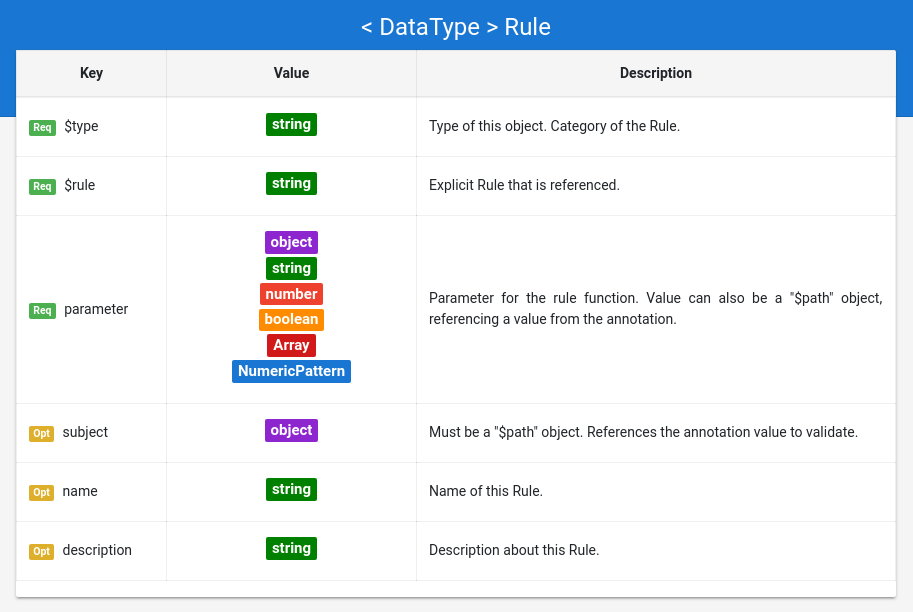

## Grammar Documentation for node type "BooleanRule"

BooleanRules are rules that apply on values which have the data type "Boolean" from Schema.org. (see "Meta_Rules.md" for details)

The specific rule type is given by the value in the "$rule" property. The properties which rules can have are explained in the Meta_Rules.md document. Note that the "subject" property can be omitted, if the "$path" object has an empty JSON Pointer as value (see Meta_Rules.md for details).

However, the data type for the "parameter" depends on the "$rule" value (e.g. arguments for the rule function), and is explained in the following.



### equals

The "equals" rule checks if a given boolean value (the validated value) matches a given boolean.

```json
{
  "$type": "BooleanRule",
  "$rule": "equals",
  "subject": {
      "$path": "/isAccessibleForFree"
  },
  "parameter": true
}
```

The parameter is a boolean which serves as the second argument for the rule function. The validated subject must be the same as the given parameter.
