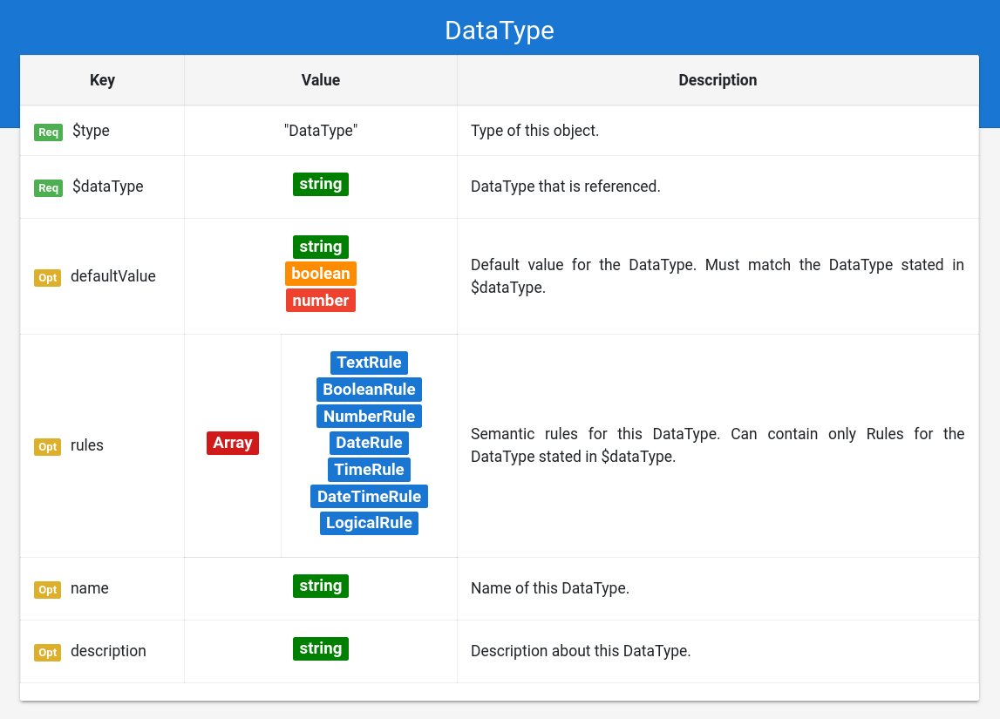

## Grammar Documentation for node type "DataType"

This is a node specifying the usage of a certain data type of Schema.org.

### $type
**Required**. Has always the string "DataType" as value.

Based on "@ type" from JSON-LD (Indicates the type of the node/object). This value is a short form for the URI identifying this node type in the DS grammar.

### $dataType
**Required**. Has an string as value.

Indicates the data type from Schema.org which is referenced here. The data type is specified in a shortform instead of the URI ("Boolean" instead of "https://schema.org/Boolean").

Possible data types:
* Text
* URL
* Boolean
* Number
* Integer
* Float
* Date
* Time
* DateTime

### defaultValue
**Optional**. Has always a value that has the data type described in $dataType.

A default value for the instance of this data type.

### rules
**Optional**. Has an array of rules as value.

Each value in the array MUST be an object containing a Rule with a $type valid for the $dataType of the parent object (see datatype mapping). Each rule must be valid for the annotation instance, so that the semantic check is successful.

Schema.org DataType | Applicable Rule Type
------------ | -------------
Text | TextRule
URL  | TextRule
Boolean | BooleanRule
Number | NumberRule
Integer  | NumberRule
Float  | NumberRule
Date | DateRule
Time | TimeRule
DateTime | DateTimeRule
All | LogicalRule

LogicalRules for a dataType are supposed to contain only Rules which are applicable to that dataType.

### name
**Optional**. Has always a string as value.

Same as the property "name" from Schema.org (meta information about the entity).

### description
**Optional**. Has always a string as value.

Same as the property "description" from Schema.org (meta information about the entity).

