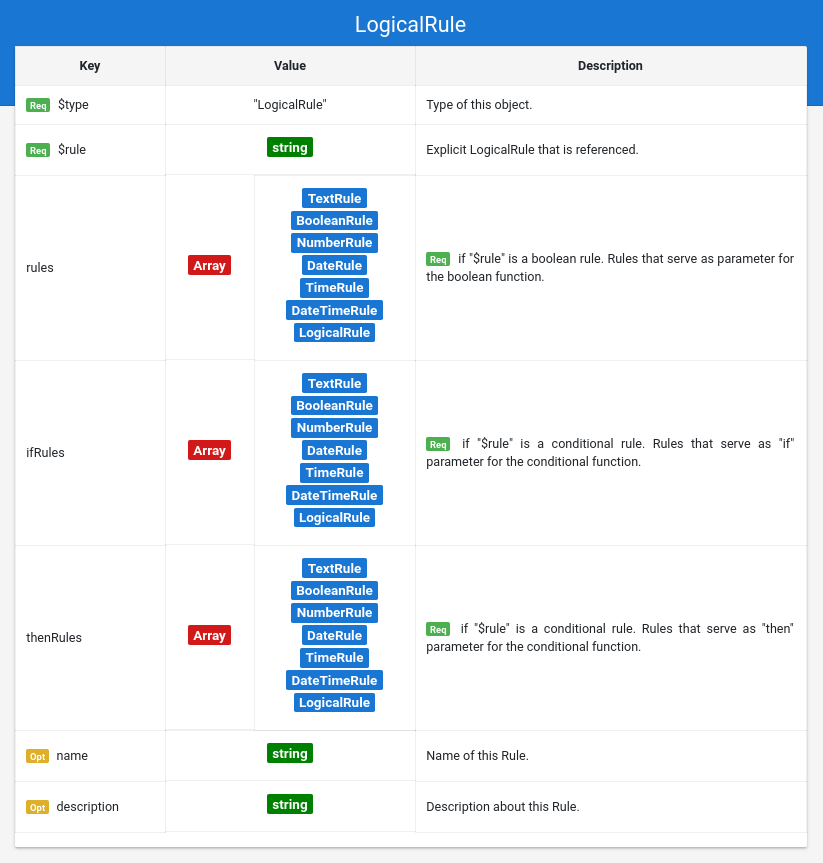

## Grammar Documentation for node type "LogicalRule"

LogicalRules are rules that can be used on any data type from schema.org and enable the usage of boolean, and causal logic (see "Meta_Rules.md" for details)

The specific rule type is given by the value in the "$rule" property. The properties which rules can have are explained in the Meta_Rules.md document.

However, there are additional properties a rule may have, depending on the "$rule" value (e.g. arguments for the rule function), which are explained in the following.





### and

Based on "AND" from boolean logic. The "and" rule checks if a set of rules passes the semantic validation. 

```json
{
  "$type": "LogicalRule",
  "$rule": "and",
  "rules": [
    {
        "$type": "TextRule",
        "$rule": "startsWith",
        "subject": {
            "$path": "/telephone"
        },
        "parameter": "+43512"
    },
    {
        "$type": "TextRule",
        "$rule": "equals",
        "subject": {
            "$path": "/address/addressLocality"
        },
        "parameter": "Innsbruck"
    }
  ],
  "description": "The telephone number must start with '+43512' and the city must be 'Innsbruck'."
}
```
All rules inside the "rules" array must pass the check, so that this LogicalRule is valid.

### or

Based on "OR" from boolean logic. The "or" rule checks if at least one rule from a set of rules passes the semantic validation. 

```json
{
  "$type": "LogicalRule",
  "$rule": "or",
  "rules": [
    {
        "$type": "TextRule",
        "$rule": "startsWith",
        "subject": {
            "$path": "/telephone"
        },
        "parameter": "+43"
    },
    {
        "$type": "TextRule",
        "$rule": "startsWith",
        "subject": {
            "$path": "/telephone"
        },
        "parameter": "+49"
    }
  ],
  "description": "The telephone number must be from Austria (+43) or from Germany (+49)."
}
```
At least one rule inside the "rules" array must pass the check, so that this LogicalRule is valid.


### not

Based on "NOT" from boolean logic. The "not" rule checks if a set of rules does NOT pass the semantic validation. 

```json
{
  "$type": "LogicalRule",
  "$rule": "not",
  "rules": [
    {
        "$type": "TextRule",
        "$rule": "equals",
        "parameter": "Germany"
    }
  ],
  "description": "The value must not be 'Germany'."
}
```

All rules inside the "rules" array must NOT pass the check, so that this LogicalRule is valid.


### ifThen

The "ifThen" rule enables a conditional restriction based on causal logic. It checks if a set of rules passes the semantic validation (ifRules). If they do, then another set of rules must also pass the semantic validation (thenRules). 

```json
{
  "$type": "LogicalRule",
  "$rule": "ifThen",
  "ifRules": [
    {
      "$type": "TextRule",
      "$rule": "equals",
      "subject": {
        "$path": "/address/addressCountry"
      },
      "parameter": "Austria"
    }
  ],
  "thenRules": [
    {
      "$type": "TextRule",
      "$rule": "startsWith",
      "subject": {
        "$path": "/telephone"
      },
      "parameter": "+43"
    }
  ],
  "description": "If the country is Austria, then the telephone number must start with +43."
}
```

If all the rules inside the "ifRules" array pass the check, then all the rules inside the "thenRules" array must also pass the check.