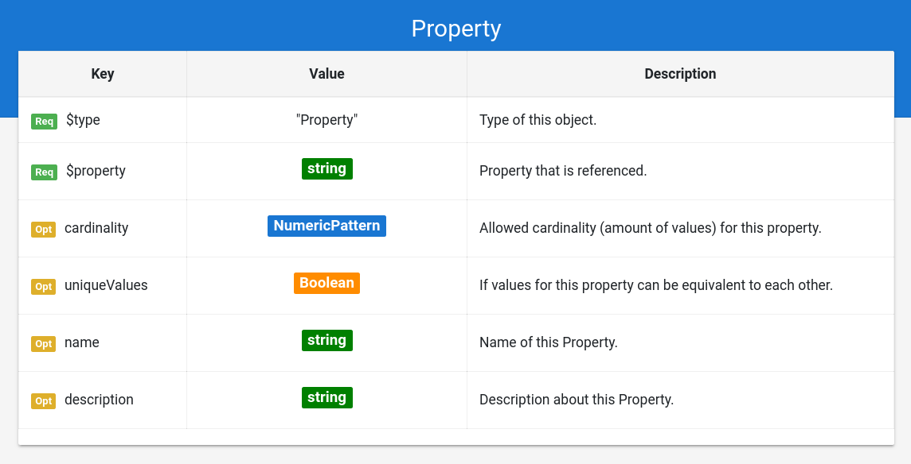

## Grammar Documentation for node type "Property"

This is a generic node specifying the usage of standard property from Schema.org. By standard it is meant that there are no syntactic constraints on the annotation on how to use this property at the given position -> any expected types (with their subclasses) of this property can be used. There are no further syntactic restrictions on the properties and their values, except the cardinality, which is optional. Semantic restrictions are possible, but not necessary.

### $type
**Required**. Has always the string "Property" as value.

Based on "@type" from JSON-LD (Indicates the type of the node/object). This value is a short form for the URI identifying this node type in the DS grammar.

### $property
**Required**. Has always a string as value.

Indicates the property from Schema.org which is referenced here. The property is specified in a short form instead of the URI ("name" instead of "https://schema.org/name").

### cardinality
**Optional**. Has always a string (numeric pattern) as value.

Specifies the allowed cardinality for this property. This numeric pattern has an own grammar to specify the allowed cardinality. See document "numericPattern_docu.md" for details. Examples:

"1-3" -> property must have at least 1 value and max. 3 values.

"(%2 & >5)" -> property must have values in a quantity that is a multiple of 2, and bigger than 5.

The default pattern for cardinality is **">=0"** (0 or more), as suggested by Schema.org, and is handled as such, if the option is not used.

### uniqueValues
**Optional**. Has a boolean as value.

Indicates if the values of this property can be equivalent to each other or not. Note that different data types may have the same "value"; A string with "true" is handled as equivalent to a boolean true. (discussion: should the data type also be the same?).

By default "uniqueValues" is set to **false**, and is handled as such if the option is not used.

### name
**Optional**. Has always a string as value.

Same as the property "name" from Schema.org (meta information about the entity).

### description
**Optional**. Has always a string as value.

Same as the property "description" from Schema.org (meta information about the entity).
